# Azure DevOps GitOps CI/CD Workflow with Comprehensive Observability

A production-ready GitOps implementation for Kubernetes deployments using Azure DevOps, ArgoCD, and a complete observability stack (Loki, Tempo, Pyroscope).

## 📋 Table of Contents

- [Overview](#overview)
- [Architecture](#architecture)
- [Prerequisites](#prerequisites)
- [Complete Setup Guide](#complete-setup-guide)
- [Verification](#verification)
- [Usage](#usage)
- [Observability](#observability)
- [Cleanup](#cleanup)
- [Troubleshooting](#troubleshooting)
- [Documentation](#documentation)

## 🎯 Overview

This project implements a **dual-repository GitOps pattern** with **end-to-end observability**:

### Repositories
- **Application Repository** (`app-repo/`): Source code, Dockerfile, Helm charts
- **Configuration Repository** (`config-repo/`): Environment-specific Kubernetes configurations

### Key Features
- ✅ **GitOps Workflow**: Automated deployments via ArgoCD
- ✅ **CI/CD Pipeline**: Azure DevOps pipelines for build and deployment
- ✅ **Comprehensive Observability**: Logs (Loki), Traces (Tempo), Profiles (Pyroscope)
- ✅ **Unified Collection**: Grafana Alloy for logs, metrics, and traces
- ✅ **Deployment Notifications**: Slack and email alerts for all deployments
- ✅ **Multi-Environment**: Dev, Staging, Production configurations

## 🏗️ Architecture

```mermaid
graph TB
    subgraph Developer["👨‍💻 Developer Workflow"]
        Dev[Developer]
    end
    
    Dev -->|Push Code| AppRepo[📦 App Repo<br/>Source Code]
    AppRepo -->|Trigger| CI[🔨 CI Pipeline<br/>Build & Test]
    CI -->|Push Image| ACR[🐳 Azure Container<br/>Registry]
    CI -->|Update Tag| ConfigRepo[⚙️ Config Repo<br/>Desired State]
    
    ConfigRepo -->|Git Pull| ArgoCD[🔄 ArgoCD<br/>GitOps Operator]
    ACR -.->|Pull Image| AKS
    ArgoCD -->|Deploy| AKS
    
    subgraph AKS["☸️ AKS Cluster"]
        subgraph Apps["Applications"]
            AppDev[🟢 App Dev]
            AppStaging[🟡 App Staging]
            AppProd[🔴 App Prod]
        end
        
        Apps --> LoadGen[📊 Load Generator<br/>Traffic Simulation]
        
        subgraph Observability["🔭 Observability Stack"]
            Alloy[📡 Grafana Alloy<br/>Unified Collector]
            Loki[📝 Loki<br/>Logs]
            Tempo[🔍 Tempo<br/>Traces]
            Pyroscope[📈 Pyroscope<br/>Profiles]
            Grafana[📊 Grafana<br/>Dashboards]
            
            Alloy -->|Logs| Loki
            Alloy -->|Traces| Tempo
            Apps -->|Profiles| Pyroscope
            Apps -->|OTLP| Alloy
            
            Loki --> Grafana
            Tempo --> Grafana
            Pyroscope --> Grafana
        end
    end
    
    ArgoCD -->|Deployment Events| Notifications[📧 Notifications<br/>Slack & Email]
    
    style Developer fill:#e1f5ff
    style AKS fill:#fff4e6
    style Observability fill:#f3e5f5
    style Apps fill:#e8f5e9
```



## 📦 Prerequisites

### Required Tools

Install these tools before starting:

#### 1. Azure CLI

**macOS:**
```bash
brew install azure-cli
```

**Linux:**
```bash
curl -sL https://aka.ms/InstallAzureCLIDeb | sudo bash
```

**Verify:**
```bash
az --version
```

#### 2. kubectl

**macOS:**
```bash
brew install kubectl
```

**Linux:**
```bash
curl -LO "https://dl.k8s.io/release/$(curl -L -s https://dl.k8s.io/release/stable.txt)/bin/linux/amd64/kubectl"
sudo install -o root -g root -m 0755 kubectl /usr/local/bin/kubectl
```

**Verify:**
```bash
kubectl version --client
```

#### 3. Helm

**macOS:**
```bash
brew install helm
```

**Linux:**
```bash
curl https://raw.githubusercontent.com/helm/helm/main/scripts/get-helm-3 | bash
```

**Verify:**
```bash
helm version
```

#### 4. ArgoCD CLI

**macOS:**
```bash
brew install argocd
```

**Linux:**
```bash
curl -sSL -o argocd-linux-amd64 https://github.com/argoproj/argo-cd/releases/latest/download/argocd-linux-amd64
sudo install -m 555 argocd-linux-amd64 /usr/local/bin/argocd
```

**Verify:**
```bash
argocd version --client
```

### Azure Account

If you don't have an Azure account:

1. **Create free account**: https://azure.microsoft.com/free/
   - $200 credit for 30 days
   - Free services for 12 months
   - Always-free services

2. **Login to Azure CLI:**
```bash
az login
```

3. **Set subscription (if you have multiple):**
```bash
# List subscriptions
az account list --output table

# Set active subscription
az account set --subscription "<subscription-id>"
```

## 🚀 Complete Setup Guide

Follow these steps in order. Each step includes verification commands.

### Step 0: Register Azure Providers (First Time Only)

Before creating resources, register the required Azure providers:

```bash
# Register all required providers
az provider register --namespace Microsoft.ContainerService
az provider register --namespace Microsoft.ContainerRegistry
az provider register --namespace Microsoft.Storage

# Wait for registration (takes 1-2 minutes)
echo "Waiting for provider registration..."
sleep 60

# Verify all are registered
az provider show -n Microsoft.ContainerService --query "registrationState" -o tsv
az provider show -n Microsoft.ContainerRegistry --query "registrationState" -o tsv
az provider show -n Microsoft.Storage --query "registrationState" -o tsv
```

All should show `Registered`. If any show `Registering`, wait another minute and check again.

### Step 1: Create Azure Resources

#### 1.1 Create Resource Group

```bash
# Create resource group
az group create \
  --name rg-gitops \
  --location eastus

# Verify
az group show --name rg-gitops --output table
```

#### 1.2 Create Azure Kubernetes Service (AKS)

> **Note on VM Size:** We use `Standard_DC2s_v3` (2 vCPUs, 8GB RAM) as it's available in most Azure subscriptions. If you encounter VM size restrictions, check available sizes with:
> ```bash
> az vm list-skus --location eastus --size Standard_DC --output table
> ```

```bash
# Create AKS cluster (this takes 5-10 minutes)
az aks create \
  --resource-group rg-gitops \
  --name aks-gitops-cluster \
  --node-count 2 \
  --node-vm-size Standard_DC2s_v3 \
  --enable-managed-identity \
  --generate-ssh-keys \
  --network-plugin azure

# Get credentials
az aks get-credentials \
  --resource-group rg-gitops \
  --name aks-gitops-cluster \
  --overwrite-existing

# Verify cluster connection
kubectl cluster-info
kubectl get nodes
```

**Expected output:**
```
NAME                                STATUS   ROLES   AGE   VERSION
aks-nodepool1-12345678-vmss000000   Ready    agent   2m    v1.27.7
aks-nodepool1-12345678-vmss000001   Ready    agent   2m    v1.27.7
```

#### 1.3 Create Azure Container Registry (ACR)

```bash
# Create ACR (name must be globally unique, lowercase, no hyphens)
ACR_NAME="acrgitops$RANDOM"
az acr create \
  --resource-group rg-gitops \
  --name $ACR_NAME \
  --sku Standard

# Attach ACR to AKS
az aks update \
  --resource-group rg-gitops \
  --name aks-gitops-cluster \
  --attach-acr $ACR_NAME

# Save ACR name for later
echo "ACR_NAME=$ACR_NAME" > .env
echo "Your ACR name: $ACR_NAME"

# Verify
az acr show --name $ACR_NAME --output table
```

#### 1.4 Create Azure Storage Account (for Loki and Tempo)

```bash
# Create storage account (name must be globally unique, lowercase, no hyphens)
STORAGE_NAME="stgitops$RANDOM"
az storage account create \
  --name $STORAGE_NAME \
  --resource-group rg-gitops \
  --location eastus \
  --sku Standard_LRS

# Create containers for observability
az storage container create \
  --name loki-chunks \
  --account-name $STORAGE_NAME

az storage container create \
  --name tempo-traces \
  --account-name $STORAGE_NAME

# Get storage key
STORAGE_KEY=$(az storage account keys list \
  --account-name $STORAGE_NAME \
  --query '[0].value' -o tsv)

# Save for later
echo "STORAGE_NAME=$STORAGE_NAME" >> .env
echo "STORAGE_KEY=$STORAGE_KEY" >> .env
echo "Your storage account: $STORAGE_NAME"

# Verify
az storage account show --name $STORAGE_NAME --output table
```

✅ **Checkpoint**: You now have AKS, ACR, and Storage Account ready!

### Step 2: Deploy Observability Stack

#### 2.1 Create Observability Namespace

```bash
kubectl create namespace observability
```

#### 2.2 Get Storage Key and Create Secret

```bash
# Load environment variables
source .env

# Get storage key (if not already in .env)
if [ -z "$STORAGE_KEY" ]; then
  STORAGE_KEY=$(az storage account keys list \
    --account-name $STORAGE_NAME \
    --query '[0].value' -o tsv)
  echo "STORAGE_KEY=$STORAGE_KEY" >> .env
fi

# Clean the key (remove any newlines/spaces)
STORAGE_KEY_CLEAN=$(echo "$STORAGE_KEY" | tr -d '\n' | tr -d ' ')

# Create secret for Loki and Tempo
kubectl create secret generic loki-azure-secret \
  --from-literal=AZURE_STORAGE_ACCOUNT="$STORAGE_NAME" \
  --from-literal=AZURE_STORAGE_KEY="$STORAGE_KEY_CLEAN" \
  -n observability

# Verify
kubectl get secret loki-azure-secret -n observability
```

#### 2.3 Deploy All Observability Components

```bash
# Deploy all components at once (includes Loki, Tempo, Pyroscope, Alloy, Grafana)
kubectl apply -f observability/loki/loki-deployment.yaml
kubectl apply -f observability/tempo/tempo-deployment.yaml

# Wait for pods to be ready (this takes 2-3 minutes)
echo "Waiting for observability stack to be ready..."
sleep 30

# Check status
kubectl get pods -n observability
```

**Expected output:**
```
NAME                       READY   STATUS    RESTARTS   AGE
alloy-xxxxx                1/1     Running   0          2m
alloy-xxxxx                1/1     Running   0          2m
grafana-xxxxx              1/1     Running   0          2m
loki-0                     1/1     Running   0          2m
pyroscope-0                1/1     Running   0          2m
tempo-0                    1/1     Running   0          2m
```

> **Note:** Loki and Tempo are configured to use filesystem storage for simplicity. For production, configure Azure Blob Storage in the config files.

#### 2.4 Access Grafana

```bash
# Get Grafana external IP (may take 1-2 minutes)
kubectl get svc grafana -n observability

# Note the EXTERNAL-IP
```

**Access Grafana:**
- URL: `http://<EXTERNAL-IP>:3000`
- Username: `admin`
- Password: `admin`

**Verify Datasources:**
1. Go to Configuration → Data Sources
2. You should see: Loki, Tempo, and Pyroscope
3. Test each datasource to confirm connectivity

✅ **Checkpoint**: Observability stack is running!

### Step 3: Deploy ArgoCD

#### 3.1 Install ArgoCD

```bash
# Create namespace
kubectl create namespace argocd

# Install ArgoCD
kubectl apply -n argocd -f https://raw.githubusercontent.com/argoproj/argo-cd/stable/manifests/install.yaml

# Wait for pods
kubectl wait --for=condition=ready pod -l app.kubernetes.io/name=argocd-server -n argocd --timeout=300s

# Verify
kubectl get pods -n argocd
```

#### 3.2 Access ArgoCD UI

```bash
# Get initial admin password
ARGOCD_PASSWORD=$(kubectl -n argocd get secret argocd-initial-admin-secret \
  -o jsonpath="{.data.password}" | base64 -d)

echo "ArgoCD Password: $ARGOCD_PASSWORD"

# Port forward to access UI
kubectl port-forward svc/argocd-server -n argocd 8080:443 &

# Login via CLI
argocd login localhost:8080 \
  --username admin \
  --password $ARGOCD_PASSWORD \
  --insecure
```

Open browser to `https://localhost:8080`
- Username: `admin`
- Password: (from above command)

#### 3.3 Configure ArgoCD Notifications

```bash
# Create Slack/Email secret (update with your credentials)
kubectl create secret generic argocd-notifications-secret \
  --from-literal=slack-token=<your-slack-bot-token> \
  --from-literal=email-username=<your-email> \
  --from-literal=email-password=<your-app-password> \
  -n argocd

# Deploy notifications configuration
kubectl apply -f gitops-operator/argocd/argocd-notifications.yaml
```

✅ **Checkpoint**: ArgoCD is ready for GitOps!

### Step 4: Setup Azure DevOps

#### 4.1 Create Azure DevOps Organization

1. Go to https://dev.azure.com
2. Sign in with your Azure account
3. Create new organization (if needed)
4. Create new project: `gitops-demo`

#### 4.2 Create Repositories

1. In Azure DevOps, go to **Repos**
2. Create two repositories:
   - `app-repo`
   - `config-repo`

#### 4.3 Push Code to Repositories

```bash
# Clone this repository
cd app-repo
git init
git remote add origin https://dev.azure.com/<your-org>/gitops-demo/_git/app-repo
git add .
git commit -m "Initial commit"
git push -u origin main

cd ../config-repo
git init
git remote add origin https://dev.azure.com/<your-org>/gitops-demo/_git/config-repo
git add .
git commit -m "Initial commit"
git push -u origin main
```

#### 4.4 Create Service Connections

1. Go to **Project Settings** → **Service connections**
2. Create **Azure Resource Manager** connection:
   - Name: `azure-subscription`
   - Select your subscription
3. Create **Docker Registry** connection:
   - Name: `azure-container-registry`
   - Registry: `<your-acr-name>.azurecr.io`
   - Use managed identity

#### 4.5 Create CI Pipeline

1. Go to **Pipelines** → **New pipeline**
2. Select **Azure Repos Git**
3. Select `app-repo`
4. Select **Existing Azure Pipelines YAML file**
5. Path: `/.azure-pipelines/ci-pipeline.yml`
6. Update variables in pipeline:
   ```yaml
   variables:
     containerRegistry: '<your-acr-name>.azurecr.io'
     dockerRegistryServiceConnection: 'azure-container-registry'
   ```
7. Save and run

✅ **Checkpoint**: CI/CD pipeline is configured!

### Step 5: Deploy Sample Application

#### 5.1 Build and Push Image

```bash
# Load ACR name
source .env

# Login to ACR
az acr login --name $ACR_NAME

# Build and push sample app
cd app-repo
docker build -t $ACR_NAME.azurecr.io/sample-app:v1.0.0 .
docker push $ACR_NAME.azurecr.io/sample-app:v1.0.0
```

#### 5.2 Create ArgoCD Application

```bash
# Update application.yaml with your ACR name
sed -i "s/myacr.azurecr.io/$ACR_NAME.azurecr.io/g" gitops-operator/argocd/application.yaml

# Create application
kubectl apply -f gitops-operator/argocd/application.yaml

# Sync application
argocd app sync sample-app-dev

# Watch deployment
argocd app get sample-app-dev --refresh
```

#### 5.3 Verify Application

```bash
# Check pods
kubectl get pods -l app=sample-app

# Get service
kubectl get svc sample-app

# Test application
kubectl port-forward svc/sample-app 8080:80 &
curl http://localhost:8080
```

**Expected output:**
```
Hello from GitOps Sample App with Observability!
```

✅ **Checkpoint**: Application is deployed and running!

## ✅ Verification

### Verify Complete Setup

Run these commands to verify everything is working:

```bash
# 1. Check Azure resources
az resource list --resource-group rg-gitops --output table

# 2. Check Kubernetes cluster
kubectl get nodes

# 3. Check observability stack
kubectl get pods -n observability

# 4. Check ArgoCD
kubectl get pods -n argocd

# 5. Check application
kubectl get pods -l app=sample-app
kubectl get svc sample-app

# 6. Check Grafana dashboards
# Open http://<grafana-external-ip>:3000
# Login: admin/admin
# Navigate to Dashboards

# 7. Check ArgoCD UI
# Open https://localhost:8080 (if port-forwarding)
# Login: admin/<password-from-step-3>

# 8. Test observability
# Generate some traffic
for i in {1..100}; do curl http://localhost:8080; done

# Check logs in Grafana
# Go to Explore → Loki → Query: {app="sample-app"}

# Check traces in Grafana
# Go to Explore → Tempo → Query: {service.name="sample-app"}

# Check profiles in Grafana
# Go to Explore → Pyroscope → Select service
```

## 📚 Usage

### API Endpoints

The sample app provides realistic REST API endpoints:

- `GET /` - API information
- `GET /health` - Health check with dependencies
- `GET /api/users` - List users
- `POST /api/users` - Create user
- `GET /api/products` - List/search products
- `POST /api/orders` - Create order
- `GET /api/slow` - Slow request (2-5s)
- `GET /api/error` - Trigger error

See [API Documentation](docs/API.md) for details.

### Traffic Generator

The load generator creates realistic traffic:

```bash
# Deploy load generator
kubectl apply -f app-repo/load-generator/deployment.yaml

# View logs
kubectl logs -f deployment/load-generator

# Stop load generator
kubectl delete deployment load-generator
```

**Traffic Patterns:**
- 70% normal traffic (browsing, orders)
- 20% traffic spikes
- 10% errors (for testing alerts)

### Deploy New Version

```bash
# 1. Update code in app-repo
# 2. Commit and push
git add .
git commit -m "feat: new feature"
git push

# 3. CI pipeline automatically:
#    - Builds new image
#    - Pushes to ACR
#    - Updates config-repo

# 4. ArgoCD automatically:
#    - Detects change
#    - Syncs to cluster
#    - Sends notification to Slack
```

### Manual Sync

```bash
argocd app sync sample-app-dev
```

### Rollback

```bash
# View history
argocd app history sample-app-dev

# Rollback to previous version
argocd app rollback sample-app-dev
```

### View Logs

```bash
# Application logs
kubectl logs -l app=sample-app -f

# In Grafana
# Explore → Loki → {app="sample-app"}
```

### View Traces

```bash
# In Grafana
# Explore → Tempo → {service.name="sample-app"}
```

### View Profiles

```bash
# In Grafana
# Explore → Pyroscope → Select sample-app
```

## 📊 Observability

### Grafana Dashboards

Access Grafana at `http://<grafana-external-ip>:3000`

**Pre-built dashboards:**
1. **Deployment Timeline**: Track all deployments
2. **Application Performance**: Logs + Traces + Profiles
3. **Pipeline Observability**: CI/CD execution traces

### Alerts

**Automatic alerts for:**
- High error rate (>5% for 5 min)
- Slow traces (P95 >2s for 10 min)
- Memory leaks (20% increase over 1 hour)
- Deployment failures

**Notification channels:**
- **Production**: #prod-deployments (Slack) + ops@example.com
- **Staging**: #staging-deployments (Slack) + qa@example.com
- **Dev**: #dev-deployments (Slack)

### Query Examples

**Find errors:**
```logql
{app="sample-app", level="error"}
```

**Find slow requests:**
```traceql
{service.name="sample-app"} && duration > 2s
```

**View CPU profile:**
- Pyroscope → `process_cpu:cpu:nanoseconds`

## 🧹 Cleanup

### Quick Cleanup

```bash
# Delete everything (Azure + Kubernetes)
./scripts/cleanup/cleanup-kubernetes.sh --yes
./scripts/cleanup/cleanup-azure.sh --yes
```

### Selective Cleanup

```bash
# Remove only observability (keep apps)
./scripts/cleanup/cleanup-observability.sh

# Remove Kubernetes resources (keep Azure)
./scripts/cleanup/cleanup-kubernetes.sh

# Remove Azure resources
./scripts/cleanup/cleanup-azure.sh --resource-group rg-gitops
```

See [scripts/cleanup/README.md](scripts/cleanup/README.md) for detailed cleanup documentation.

## 🔧 Troubleshooting

### Azure CLI Issues

**Problem**: `az login` fails

**Solution**:
```bash
# Clear cache
az account clear
az login --use-device-code
```

### Kubectl Connection Issues

**Problem**: `kubectl` cannot connect to cluster

**Solution**:
```bash
# Re-get credentials
az aks get-credentials \
  --resource-group rg-gitops \
  --name aks-gitops-cluster \
  --overwrite-existing

# Verify
kubectl cluster-info
```

### Pods Not Starting

**Problem**: Pods stuck in `Pending` or `CrashLoopBackOff`

**Solution**:
```bash
# Check pod details
kubectl describe pod <pod-name> -n <namespace>

# Check logs
kubectl logs <pod-name> -n <namespace>

# Common issues:
# - Insufficient resources: Scale up nodes
# - Image pull errors: Check ACR attachment
# - Secret missing: Verify secrets exist
```

### Grafana Not Accessible

**Problem**: Cannot access Grafana UI

**Solution**:
```bash
# Check service
kubectl get svc grafana -n observability

# If no EXTERNAL-IP, use port-forward
kubectl port-forward -n observability svc/grafana 3000:3000

# Access at http://localhost:3000
```

### ArgoCD Sync Failures

**Problem**: Application not syncing

**Solution**:
```bash
# Check application status
argocd app get sample-app-dev

# View sync errors
argocd app get sample-app-dev --show-operation

# Force sync
argocd app sync sample-app-dev --force --prune
```

### No Logs in Loki

**Problem**: Logs not appearing in Grafana

**Solution**:
```bash
# Check Alloy pods
kubectl get pods -n observability -l app=alloy

# Check Alloy logs
kubectl logs -n observability -l app=alloy --tail=50

# Check Loki
kubectl logs -n observability -l app=loki --tail=50

# Verify Loki endpoint
kubectl exec -n observability <alloy-pod> -- curl http://loki:3100/ready
```

## 🧹 Cleanup

### Quick Cleanup (Everything)

Delete all Azure resources (AKS, ACR, Storage):

```bash
./scripts/cleanup/cleanup-azure.sh --resource-group rg-gitops
```

### Partial Cleanup

**Remove only Kubernetes resources (keep Azure infrastructure):**
```bash
./scripts/cleanup/cleanup-kubernetes.sh
```

**Remove only observability stack (keep apps and ArgoCD):**
```bash
./scripts/cleanup/cleanup-observability.sh
```

### Manual Cleanup

```bash
# Delete Kubernetes namespaces
kubectl delete namespace observability
kubectl delete namespace argocd

# Delete Azure resource group
az group delete --name rg-gitops --yes
```

## 📖 Documentation

- **[API.md](docs/API.md)**: API endpoint documentation
- **[OBSERVABILITY.md](docs/OBSERVABILITY.md)**: Observability architecture and components
- **[OBSERVABILITY-RUNBOOK.md](docs/OBSERVABILITY-RUNBOOK.md)**: Operational procedures and queries
- **[OBSERVABILITY-TROUBLESHOOTING.md](docs/OBSERVABILITY-TROUBLESHOOTING.md)**: Common issues and solutions
- **[DEPLOYMENT.md](observability/DEPLOYMENT.md)**: Detailed deployment guide
- **[VM-SIZE-NOTES.md](docs/VM-SIZE-NOTES.md)**: VM size selection and alternatives
- **[Load Generator](app-repo/load-generator/README.md)**: Traffic generator documentation
- **[Cleanup Scripts](scripts/cleanup/README.md)**: Resource cleanup documentation

## 🎓 Learning Resources

- **GitOps**: https://www.gitops.tech/
- **ArgoCD**: https://argo-cd.readthedocs.io/
- **Grafana Alloy**: https://grafana.com/docs/alloy/
- **Grafana Loki**: https://grafana.com/docs/loki/
- **Grafana Tempo**: https://grafana.com/docs/tempo/
- **Pyroscope**: https://grafana.com/docs/pyroscope/
- **Azure AKS**: https://docs.microsoft.com/en-us/azure/aks/
- **Helm**: https://helm.sh/docs/

## 📝 License

MIT

## 🤝 Contributing

Contributions welcome! Please read the contribution guidelines first.

## 💬 Support

For issues and questions:
1. Check [Troubleshooting](#troubleshooting) section
2. Review [Documentation](#documentation)
3. Check observability dashboards for insights
4. Contact DevOps team

---

**Built with ❤️ for production-ready GitOps deployments**
